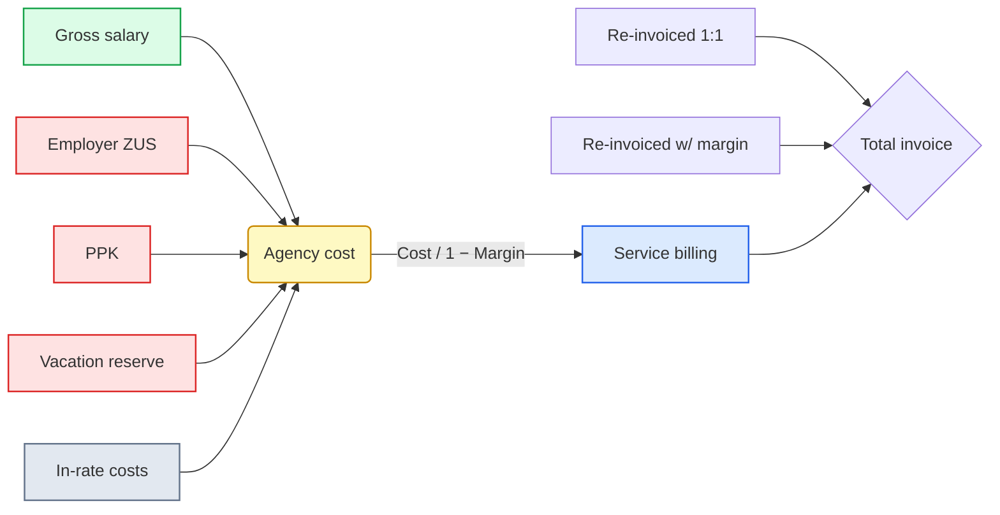
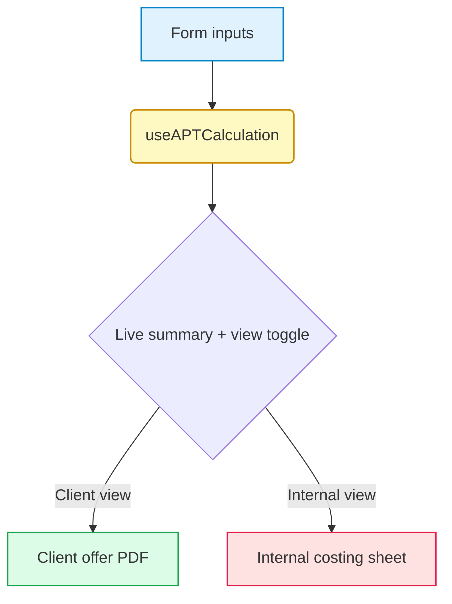

# HR KONO / APT WORK — Pricing & Offer Engine


A browser-based pricing and quoting tool for a temporary-staffing agency. It turns a contractor's gross hourly rate into a fully-loaded client rate — ZUS, funds, operational costs, and margin — and produces a clean, client-ready PDF plus an internal costing sheet. **Zero backend, zero stored data, runs entirely in the browser.**

> **Internal tool** for the HR KONO S.A. / APT WORK Sp. z o.o. sales team. Live at **[hr-kono-oferta.vercel.app](https://hr-kono-oferta.vercel.app)**.

---

## Contents

- [Why it exists](#why-it-exists)
- [What it does](#what-it-does)
- [Who uses it](#who-uses-it)
- [How pricing works](#how-pricing-works)
- [Architecture](#architecture)
- [Tech stack](#tech-stack)
- [Getting started](#getting-started)
- [Deployment](#deployment)
- [Governance & compliance](#governance--compliance)
- [Contributing](#contributing)

---

## Why it exists

Sales reps used to price staffing offers by hand in spreadsheets. The result was slow, inconsistent across the team, and easy to get wrong — and the working files mixed the agency's internal cost structure with what the client was meant to see.

This tool standardises pricing for the whole sales org and removes those risks:

- **One pricing model, applied consistently** by every rep, every time.
- **Two clearly separated outputs** — a transparent client offer and an internal costing sheet — so internal economics never leak into a client-facing document.
- **Live deal support** — a presentation-safe view reps can show on screen during a client call.
- **Faster quote-to-send** — from inputs to a print-ready PDF in seconds, no spreadsheet wrangling.

## What it does

**Pricing engine**
- Forward pricing: contractor gross rate → fully-loaded client hourly rate.
- Reverse pricing: start from a target client rate and back-solve the contractor gross rate (binary search).
- Margin modelled **on sales value** (revenue-based), not as a cost markup — see [How pricing works](#how-pricing-works).
- Contractor ZUS variants (standard, student under 26, overlapping titles) and per-entity accident-insurance rates.
- Flexible additional costs with four billing modes: in-rate, re-invoiced with margin, re-invoiced 1:1, and client-side.
- One-time costs (recruitment, medicals, PPE) amortised across the contract horizon.

**Client-facing offer (PDF)**
- Transparent rate build-up: gross → ZUS & funds → handling → total cost → margin → service rate.
- Three clean cost sections: included in the rate / re-invoiced / client-side.
- Professional letterhead, "offer valid until" date, prepared-by signature block, and legal footer.
- A4 print-optimised, brand colours preserved in the exported PDF.

**Internal costing sheet**
- Full cost breakdown, profitability analysis, and per-worker / per-hour margin.
- Contract value over the horizon and a 12-month projection.
- Margin-health status against risk thresholds.

**Live-call safety**
- A **Client / Internal view toggle** in the live summary. Client view hides internal economics; generating a PDF in client view omits the internal sheet entirely.

**Scenario comparison**
- Optional rate variants (e.g. day / night / weekend) rendered as side-by-side columns in a single offer.

## Who uses it

| Audience | What they get |
| --- | --- |
| **Sales reps** | Fast, consistent quotes; a safe live-call view; one-click client PDF. |
| **Sales leadership / board** | Internal costing sheet with profitability, contract value, 12-month projection, and margin-health signals. |
| **Clients** | A transparent, professional offer showing the hourly service rate and what it includes. |

## How pricing works

The pricing model treats **margin as a percentage of revenue, not as a markup on cost**. This keeps the headline margin figure aligned with how the deal is actually invoiced.

**Core formula**

```
Billing = Agency Cost / (1 − Margin%)
```

Where `Agency Cost = Gross + Employer ZUS + PPK + Vacation Reserve + in-rate operational costs`. A 13% margin therefore means 13 PLN of margin on every 100 PLN invoiced.



Re-invoiced cost items (accommodation, transport, medicals) are billed as **separate invoice lines** rather than being folded into the hourly service rate, so the quoted hourly rate stays clean and comparable.

> Worked salary/tax components follow Polish statutory rates. The exact rates and exemption logic are locked — see [Governance & compliance](#governance--compliance).

## Architecture

Client-side SPA. All calculation logic lives in one hook; components are presentation only.

```
App.tsx                       # Entry point / view router (edit ↔ preview)
index.tsx                     # React mount + Vercel Analytics

hooks/
  useAPTCalculation.ts        # Pricing engine: types, forward/reverse calc, margin status
  useAPTCalculation.test.ts   # Golden-number tests (calculation guardrail)

components/
  APTCalculatorForm.tsx       # Input form + live summary panel + view toggle
  APTOffer.tsx                # Client offer + internal costing sheet
  PDFMainTable.tsx            # Gi Group rate build-up (multi-column variants)
  PDFFooter.tsx               # Legal footer, signatures, letterhead
  CostRow.tsx                 # Editable additional-cost row
  HelpPopover.tsx             # Inline field help

constants/
  business.ts                 # Margin-health thresholds
  company.ts                  # Agency registration details (letterhead)
  helpContent.ts              # Field help copy
```



## Tech stack

- **React 19** + **TypeScript** (strict)
- **Vite 6** build, dev server on port 3000
- **Tailwind CSS** via CDN + utility classes
- **Lucide React** icons
- **Vitest** + Testing Library
- **Vercel Analytics**
- **Session storage** for input persistence (no backend, no database)

## Getting started

This project uses **pnpm** (lockfile committed).

```bash
pnpm install      # install dependencies
pnpm dev          # dev server at http://localhost:3000
pnpm test         # run the Vitest suite
pnpm build        # type-check + production build to dist/
```

## Deployment

Production deploys automatically to **Vercel** on merge to `main`. The build is fully static (`dist/`) and can be hosted anywhere.

To embed in another site, host the build on a subdomain and use an iframe:

```html
<iframe src="https://calculator.example.com" width="100%" height="800" style="border:0" title="Pricing calculator"></iframe>
```

For subfolder hosting (e.g. `example.com/calculator/`), set `base` in `vite.config.ts` accordingly.

### CDN dependencies

The app loads Tailwind from `cdn.tailwindcss.com` and ESM modules from `esm.sh`; both must be reachable from the client.

## Governance & compliance

The salary and statutory-cost math is a compliance surface — it determines whether quoted rates are legally sound.

- **Calculation rates and exemption logic are locked.** Employer ZUS components, fund rates, and contractor-variant exemptions must not be changed without sign-off from the HR/payroll department.
- **Refactoring the engine is allowed; the output must be identical.** The golden-number suite in `useAPTCalculation.test.ts` is the guardrail — `pnpm test` must stay green on every change.
- **Any change that moves a calculated number requires explicit HR approval** referenced in the pull request.
- UI, labels, formatting, and new non-calculation inputs are free to change.

## Contributing

- **Branch + PR only** — never commit directly to `main`.
- **[Conventional Commits](https://www.conventionalcommits.org/)**: `feat:`, `fix:`, `docs:`, `refactor:`, `chore:`.
- Run `pnpm test` and `pnpm build` before opening a PR; review `git status` before staging.
- Calculation changes: follow [Governance & compliance](#governance--compliance).

---

_Proprietary — internal tool of HR KONO S.A. / APT WORK Sp. z o.o. Not for external distribution._
