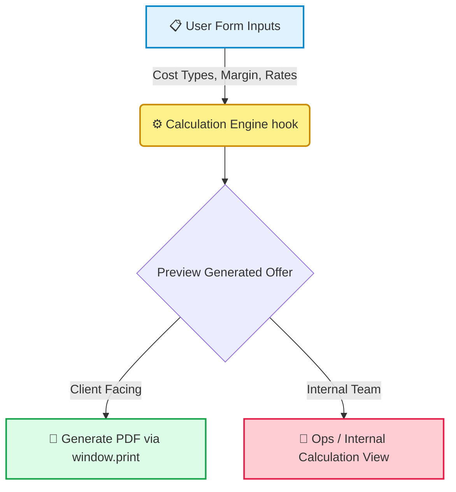
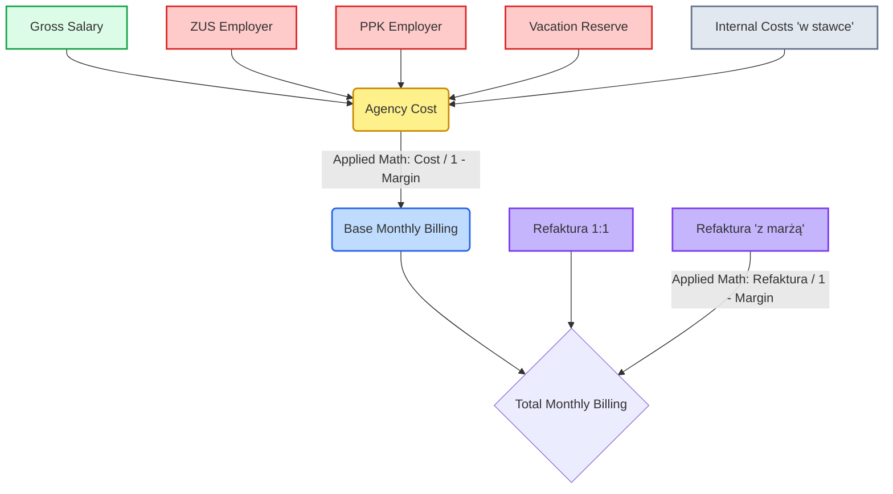

# 🏢 HR KONO - System Ofertowy


A comprehensive calculator and offer generation system designed for HR KONO. It enables quick creation of complex cost calculations and native PDF offers for clients, entirely within the browser.

---

## ✨ Features

- 🧮 **Advanced Cost Calculation:** Computes ZUS, PPK, margin models, and one-time/monthly costs accurately.
- 📄 **Native PDF Generation:** Relies on native `window.print()` and `@media print` CSS for robust, dependency-free PDF creation.
- 💸 **Precise Financial Formatting:** Displays monetary values correctly in Polish formatting (e.g., `1 234,56 zł`).
- 🎨 **Brand Aligned:** Uses HR KONO's official color palette (`#396542` and `#c0a068`).
- ⚡ **Zero Backend Required:** Operates strictly as a Single Page Application (SPA).

---

## 📈 System Architecture & Flow



---

## 📊 Calculation Architecture & Maths

The core of the pricing model strictly adheres to HR-KONO conventions, where the margin is treated as a percentage of the final revenue, **not as a standard markup**.

### 🔢 Margin Formula
`Billed Amount = Cost / (1 - Margin Percentage)`

### 🧩 Financial Data Flow



---

## 🛠 Tech Stack

- **Framework:** React 19
- **Language:** TypeScript
- **Build Tool:** Vite
- **Styling:** Tailwind CSS (via CDN)
- **Icons:** Lucide React
- **Package Manager:** `pnpm` (strictly enforced)

---

## 🚀 Local Development

The project strictly uses **`pnpm`** for package management.

1. **Install dependencies:**
   ```bash
   pnpm install
   ```

2. **Start the development server:**
   ```bash
   pnpm dev
   ```

3. **Run tests (Vitest):**
   ```bash
   pnpm test
   ```

4. **Build the application:**
   ```bash
   pnpm build
   ```

---

## 🌍 Integration & Deployment

This application generates static files that can be hosted anywhere.

### Option 1: Iframe Embedding (Recommended)

Host the compiled output on a subdomain and embed it via an iframe:

```html
<iframe
  src="https://calculator.yourdomain.com"
  width="100%"
  height="800px"
  style="border: none;"
  title="HR KONO Calculator">
</iframe>
```

### Option 2: Direct Subfolder Deployment

If deploying to a subfolder (e.g., `yourdomain.com/calculator/`), update the `base` property in `vite.config.ts`:

```typescript
import { defineConfig } from 'vite'
import react from '@vitejs/plugin-react'

export default defineConfig({
  plugins: [react()],
  base: '/calculator/', // Add this line
})
```

---

## ⚠️ CDN Dependencies

The application relies on these external CDNs (defined in `index.html` via ESM imports and standard tags). Ensure they are accessible:

- Tailwind CSS (`cdn.tailwindcss.com`)
- ESM modules via `esm.sh` (React, Vite, Lucide-React, etc.)
